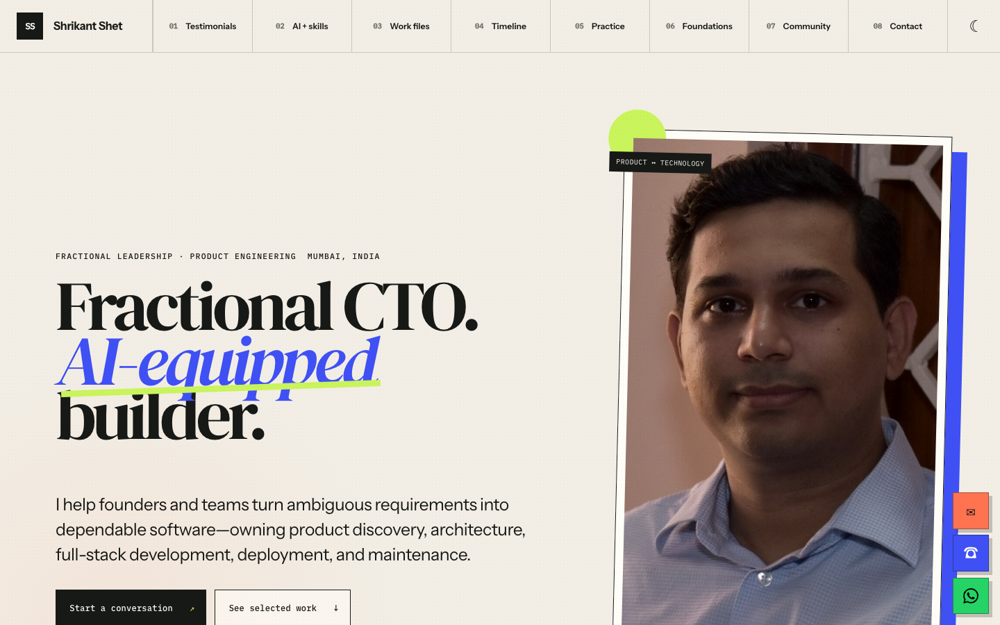
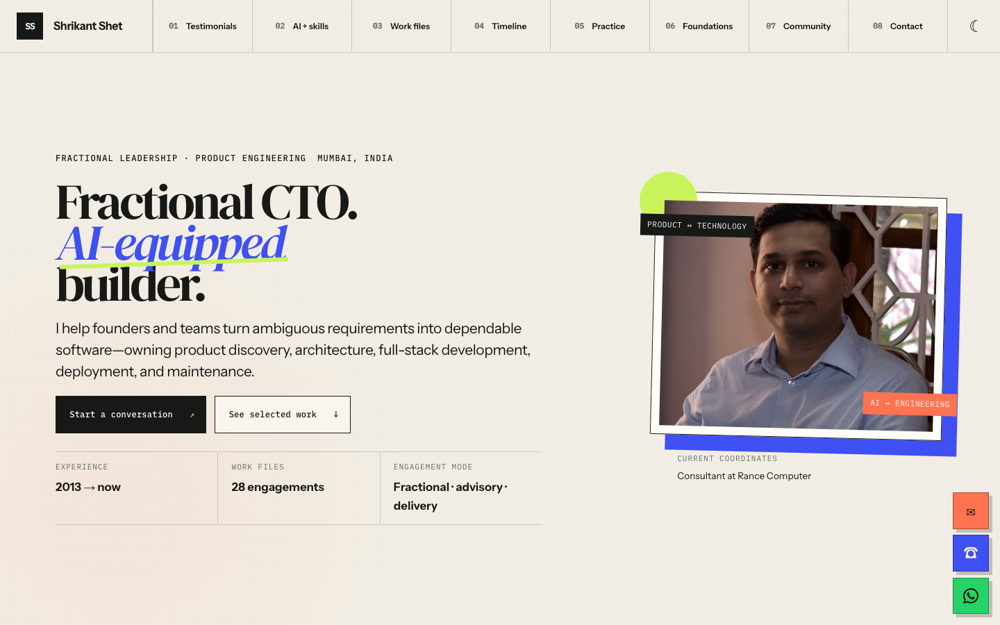
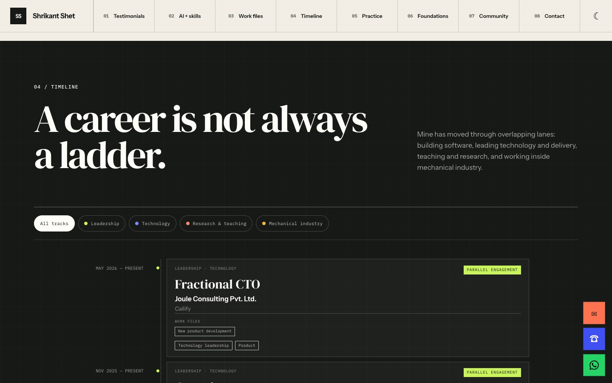
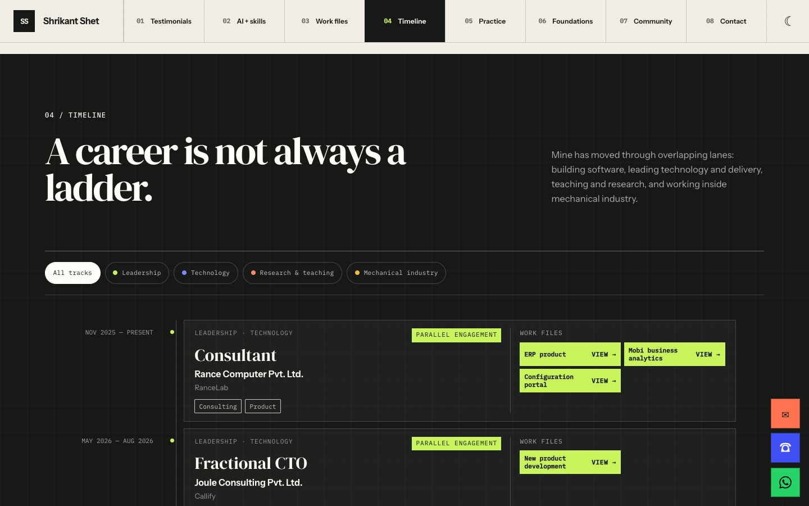

# Portfolio layout comparison

Captured at 1440 × 900 in Chromium, using the light theme and reduced motion.

- Before: `2049e67` (the base branch before the layout changes).
- After: `11a2b5a` (compact layout, iPhone header fix, and corrected engagement data).

| View | Before | After |
| --- | --- | --- |
| Hero |  |  |
| Timeline |  |  |

The iPhone status-bar behavior was checked separately in iPhone Mirroring in light and dark themes. These desktop captures demonstrate layout changes, not Safari's native status-bar rendering.
