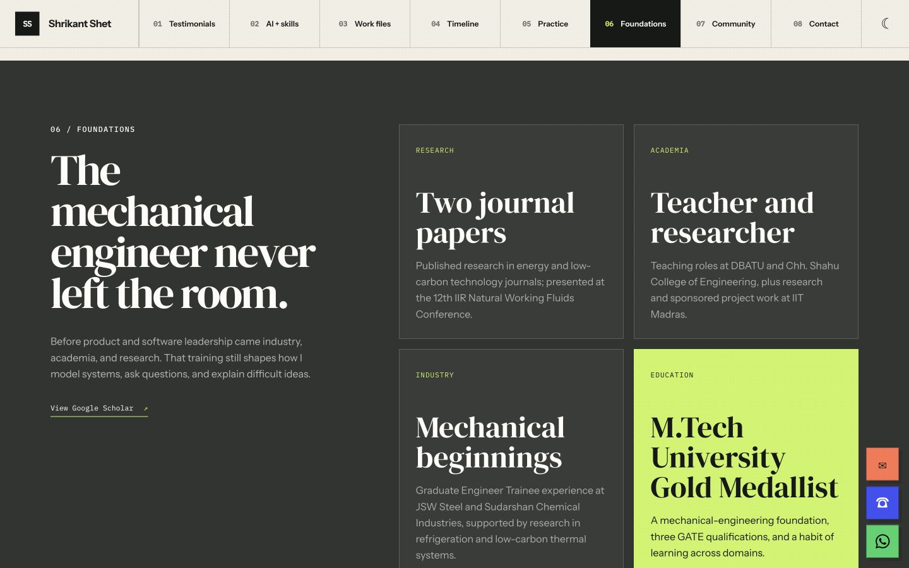
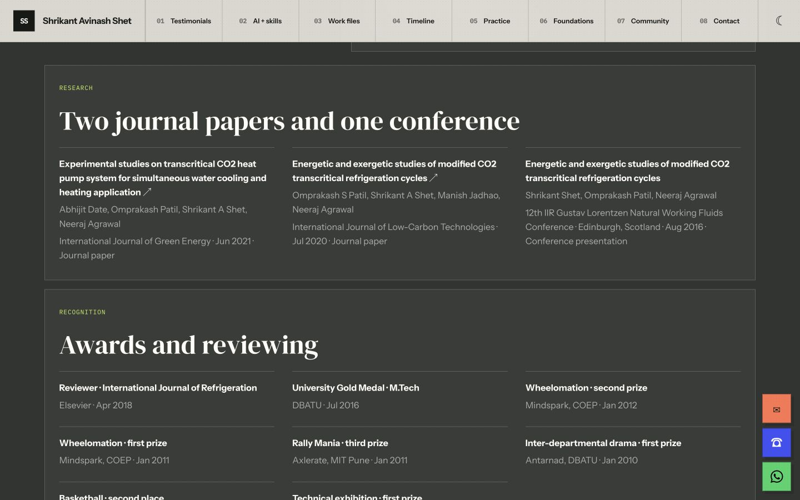

# Profile reconciliation and Foundations layout

Captured in Chrome at 1440 × 900 with the light theme.

- Before: `1a8368a`, the base branch before profile reconciliation.
- After: the reconciled portfolio in this change.
- The before view shows the original Foundations overview; the after view is scrolled to the full-width research and recognition cards below education.

| Before | After |
| --- | --- |
|  |  |

The updated layout was also checked at 390 × 844: cards and credential records use a single column without horizontal overflow. All 31 credentials are expanded, with no collapse control. The card title is “Courses and certifications”.
